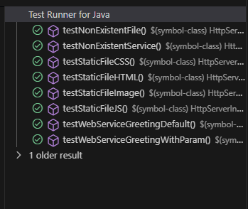

# AREP Laboratory 4 - Concurrent Server & Docker Deployment

## Resumen del Proyecto

Este proyecto implementa un servidor web HTTP concurrente en Java, inspirado en el patrón IoC de Spring Boot. Permite servir archivos estáticos (HTML, CSS, JS, imágenes) y exponer servicios RESTful mediante anotaciones personalizadas. El despliegue se realiza usando Docker y Docker Compose, facilitando la ejecución y pruebas en cualquier entorno.

## Arquitectura y Diseño de Clases

### Componentes Principales

1. **WebApplication**: Punto de entrada principal. Configura rutas de archivos estáticos y arranca el servidor.
2. **HttpServer**: Encargado de aceptar conexiones, gestionar servicios REST y servir archivos estáticos. Ahora soporta apagado elegante vía shutdown hook.
3. **HttpServerThread**: Atiende cada cliente en un hilo separado para concurrencia.
4. **HttpRequest / HttpResponse**: Encapsulan la lógica de solicitudes y respuestas HTTP.
5. **Framework de Anotaciones**:
   - `@RestController`: Marca clases como controladores web.
   - `@GetMapping`: Define rutas HTTP GET.
   - `@RequestParam`: Extrae parámetros de consulta.

### Diagrama de Flujo

```
Cliente HTTP Request → HttpServer → 
    ├── /app/* → invokeService() → Reflexión → Método anotado
    └── /* → handleStaticFiles() → Archivos desde /resources
```
## Implementacion de concurrencia

```java
public class HttpServerThread implements Runnable {
    private Socket socket;

    public HttpServerThread (Socket socket){
        this.socket = socket;
    }

    @Override
    public void run(){
        try{
        int clientNumber = HttpServer.getClientNumber();
        System.out.println("Client " + clientNumber + " at " + socket.getInetAddress() + " has connected.");
        
        OutputStream out = socket.getOutputStream();
        BufferedReader in = new BufferedReader(
                new InputStreamReader(
                        socket.getInputStream()));
        String inputLine;
        boolean isFirstLine = true;
            URI requestURI = null;
            while ((inputLine = in.readLine()) != null) {
                if (isFirstLine) {
                    requestURI = new URI(inputLine.split(" ")[1]);
                    System.out.println("Path: " + requestURI.getPath());
                    isFirstLine = false;
                }
                System.out.println("Received: " + inputLine);
                if (!in.ready()) {
                    break;
                }
            }
            
            String requestPath = requestURI.getPath();
            if (requestPath.startsWith("/app") && !HttpServer.hasFileExtension(requestPath)) {
                HttpServer.invokeService(requestURI, out);
            } else {
                HttpServer.handleStaticFiles(requestURI, out);
            }
            
            in.close();
            socket.close();
        } catch (Exception e) {
            e.printStackTrace();
        }
    }

}
```

## Instalación y Despliegue

### Prerrequisitos
- Java 17 o superior
- Maven 3.6 o superior
- Docker y Docker Compose

### Compilación local
```bash
mvn clean install
```

### Construcción de la imagen Docker
```bash
docker build --tag arep-taller4 .
```

### Despliegue con Docker Compose
```bash
docker-compose up --d
```

### URLs Disponibles
- `http://localhost:35000/` - Página principal
- `http://localhost:35000/app/greeting` - Saludo por defecto
- `http://localhost:35000/app/greeting?name=Juan` - Saludo personalizado
- `http://localhost:35000/index.html` - Archivo estático
- `http://localhost:35000/app.js` - JavaScript
- `http://localhost:35000/ballena.jpg` - Imagen


## Evidencia de Despliegue y Pruebas

### Pruebas Unitarias
```bash
mvn test
```

### Imágenes del despliegue



### Video demostrativo

Adjunta aquí el enlace o archivo del video mostrando el despliegue y funcionamiento del servidor y los servicios REST. Ejemplo:

[Ver video de despliegue](https://drive.google.com/your-demo-video)


## Extensibilidad

Para agregar nuevos servicios, simplemente crea métodos en `AppController`:

```java
@GetMapping("/nuevo")
public static String nuevoServicio(@RequestParam(value = "param", defaultValue = "default") String param) {
    return "Nuevo servicio: " + param;
}
```


## Autor
Juan Andres Rodriguez Penuela


